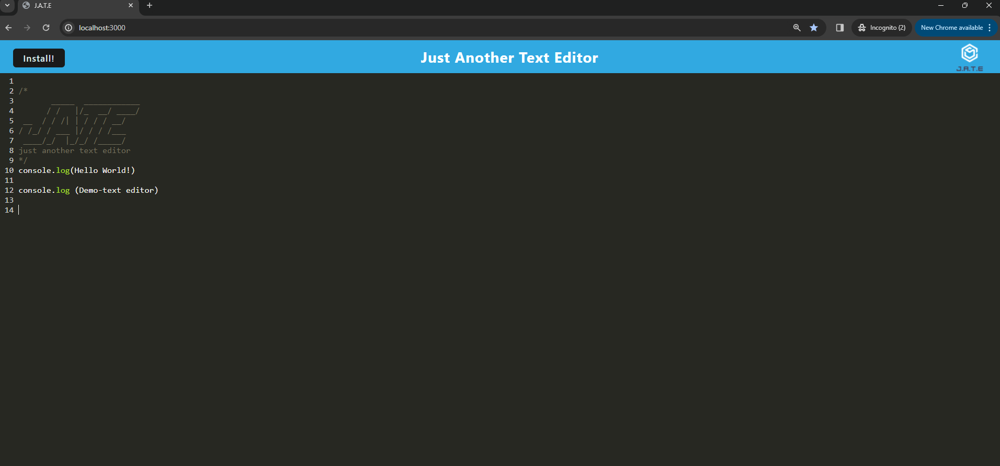
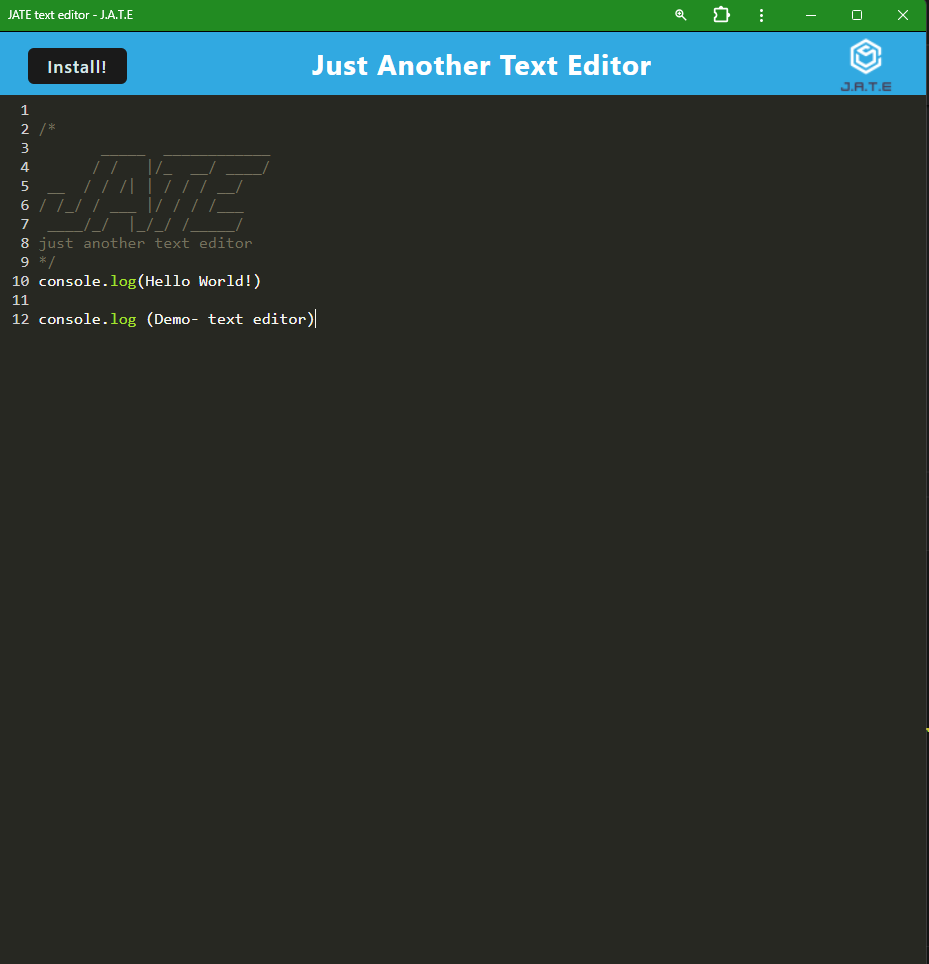
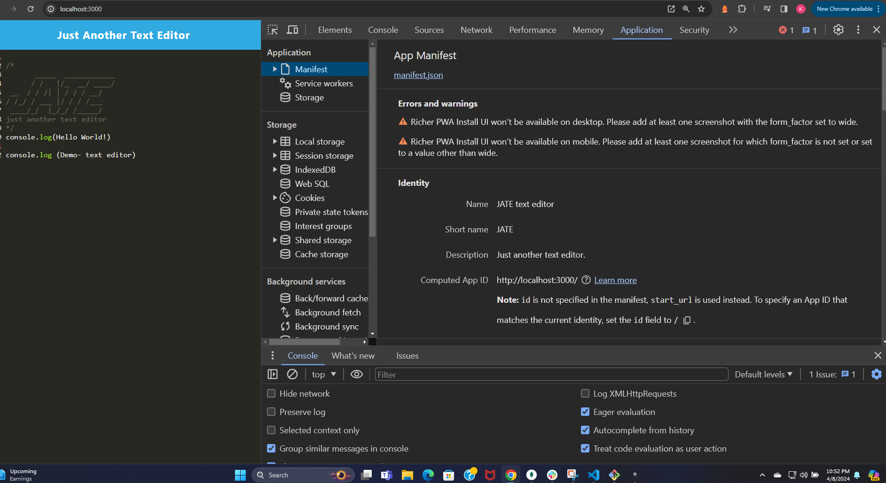
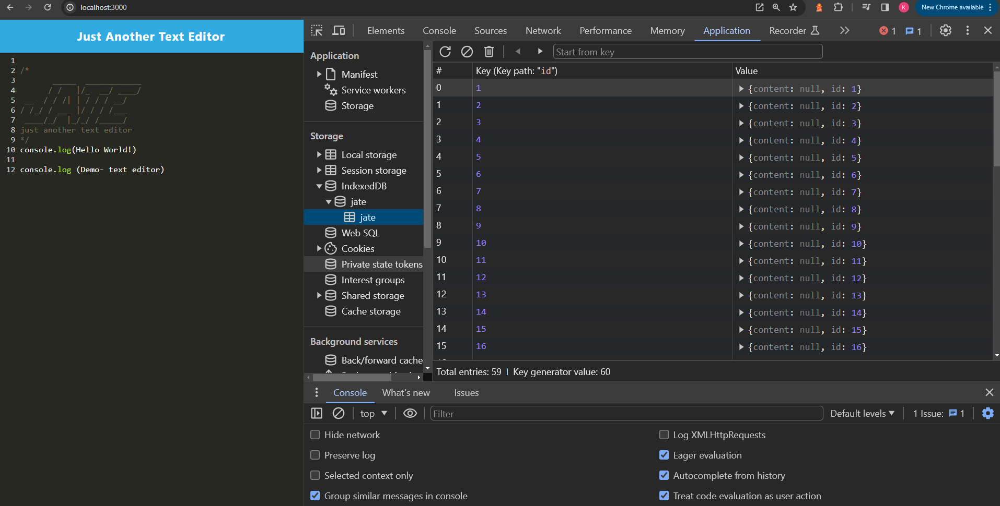

# Text-Editor

# Description 

This is a simple buliding the back end for a  text editor that allows users to create and edit documents. The appcation the user can creating and managing text documents efficiently, regardless of their device or location, while offering the performance and functionality of a native application.


# Table of Contents
- Installation
- Usage
- Credits
- License
- Questions

#  Installation

```
npm install 

```
 in the terminal to install dependencies in the root folder, client folder, and server folder

```
npm start

```
to run the application on localhost:3000


link to the repository : https://github.com/KittiyaLooknam/Text-Editor.git

# Usage
- write and edit snippets with built in  text editor
- Save your date to the locally using IndexedDB 
- Install this apication as a PWA so you can access it offline in your browser



The following image shows the application's  Installed the Text Editor. The user will be able to create notes and save them for later use. 




The following image shows the application's manifest.json file:




The following image shows the application's IndexedDB storage:



# Credits 
Thank you Louis Delia Tech Bootcamp Coding

# License
This project is licensed under the MIT license.

# Questions 
If you have any questions about this repo, please feel free to contact me at my email : kittiya.goldberg1@gmail.com and Github profile : KittiyaLooknam
